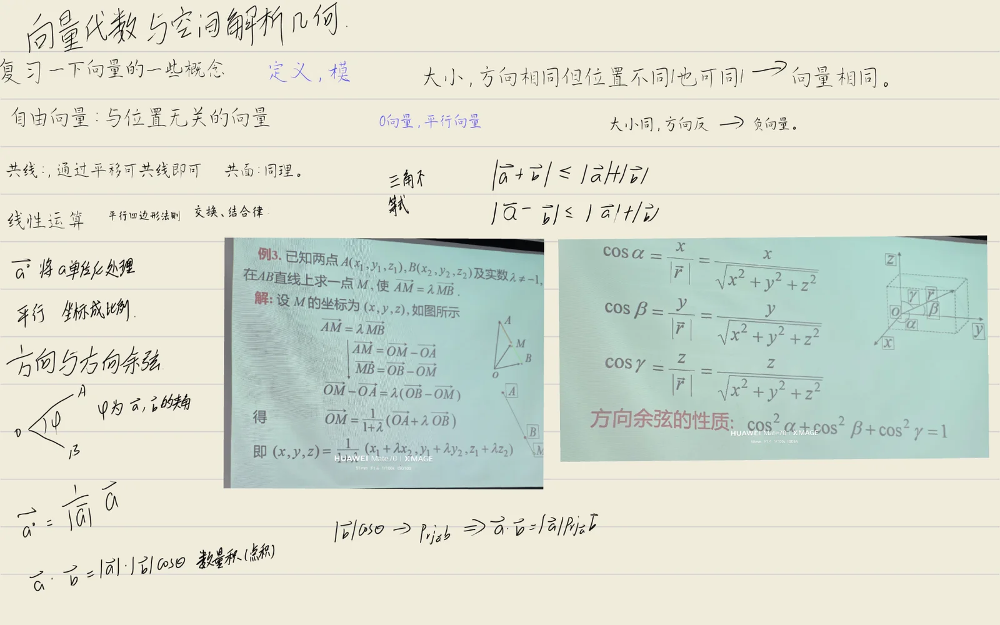
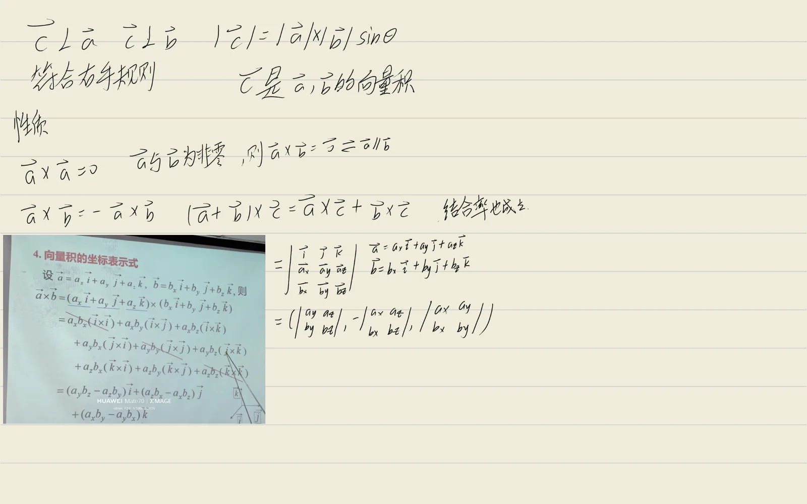
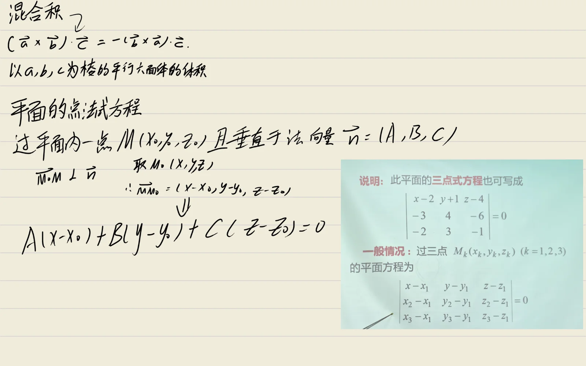
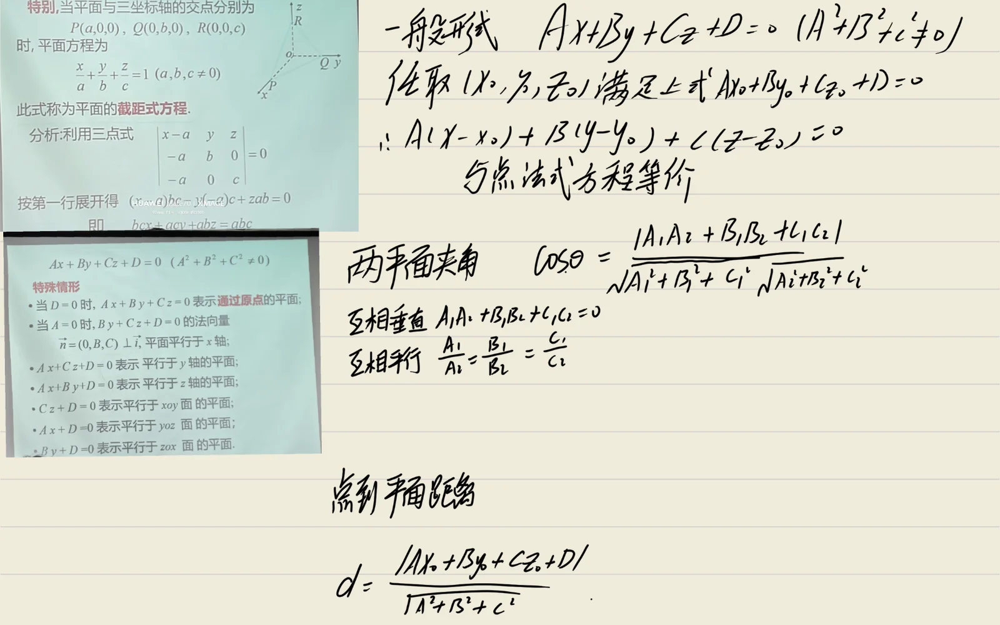
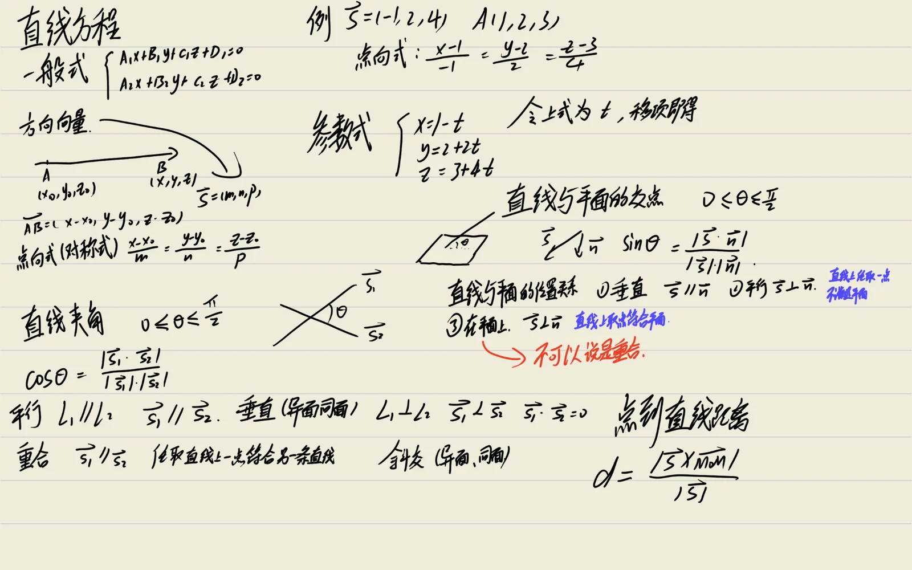
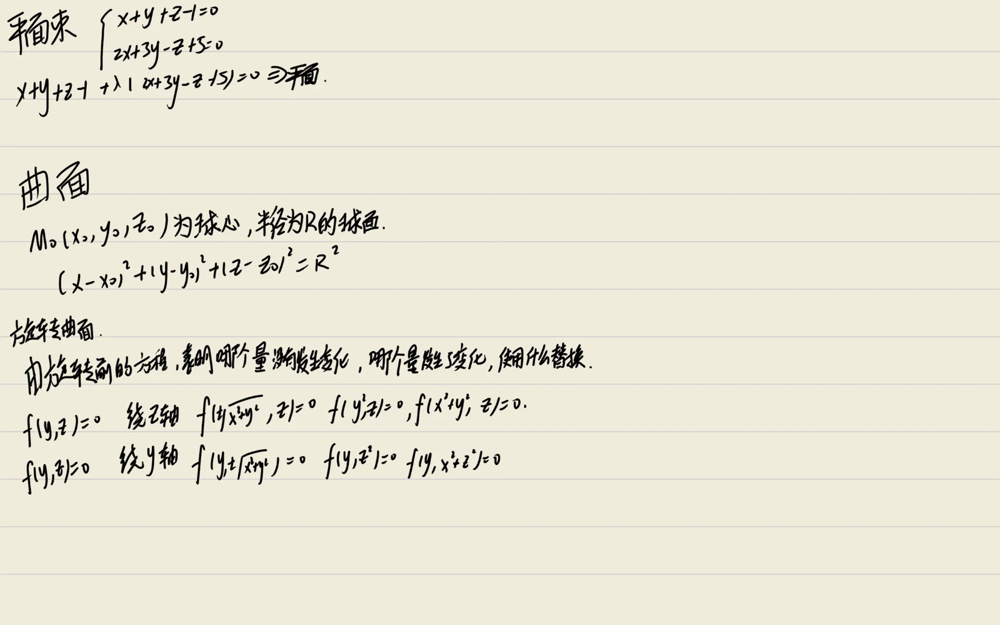
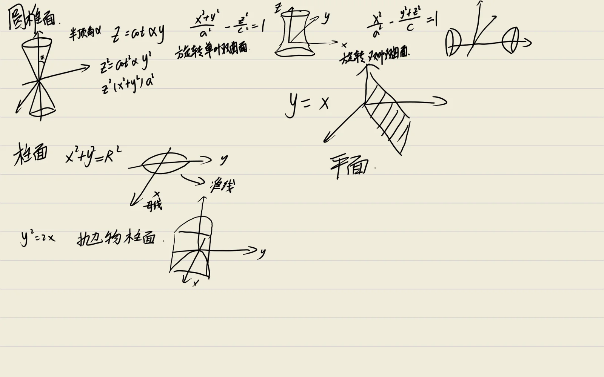
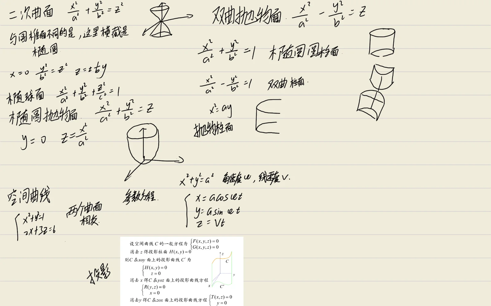

## 关键定理与公式推导

### 1. 向量的模与方向余弦

$$
|\vec{a}| = \sqrt{a_x^2 + a_y^2 + a_z^2}, \quad \cos\alpha = \frac{a_x}{|\vec{a}|}, \, \cos\beta = \frac{a_y}{|\vec{a}|}, \, \cos\gamma = \frac{a_z}{|\vec{a}|}
$$

:::derivation
设向量 $\vec{a} = a_x \vec{i} + a_y \vec{j} + a_z \vec{k}$，其中 $\vec{i}, \vec{j}, \vec{k}$ 是两两垂直的单位正交基。

**模的公式推导**：

将向量 $\vec{a}$ 的起点置于原点，终点为 $M(a_x, a_y, a_z)$。由空间两点间距离公式（勾股定理的三维推广）：

$$
|\vec{a}| = |OM| = \sqrt{(a_x - 0)^2 + (a_y - 0)^2 + (a_z - 0)^2} = \sqrt{a_x^2 + a_y^2 + a_z^2}
$$

也可由 $\vec{a} \cdot \vec{a} = a_x^2 + a_y^2 + a_z^2$ 及 $\vec{a} \cdot \vec{a} = |\vec{a}|^2 \cos 0 = |\vec{a}|^2$ 得到 $|\vec{a}|^2 = a_x^2 + a_y^2 + a_z^2$。

**方向余弦的推导**：

设 $\vec{a}$ 与 $x, y, z$ 轴正向的夹角分别为 $\alpha, \beta, \gamma$（称为方向角）。由数量积定义：

$$
\vec{a} \cdot \vec{i} = |\vec{a}| \cdot |\vec{i}| \cos\alpha = |\vec{a}| \cos\alpha
$$

另一方面，由坐标计算：

$$
\vec{a} \cdot \vec{i} = (a_x \vec{i} + a_y \vec{j} + a_z \vec{k}) \cdot \vec{i} = a_x (\vec{i} \cdot \vec{i}) + a_y (\vec{j} \cdot \vec{i}) + a_z (\vec{k} \cdot \vec{i}) = a_x \cdot 1 + 0 + 0 = a_x
$$

故 $|\vec{a}| \cos\alpha = a_x$，即 $\cos\alpha = \dfrac{a_x}{|\vec{a}|}$。同理 $\cos\beta = \dfrac{a_y}{|\vec{a}|}$，$\cos\gamma = \dfrac{a_z}{|\vec{a}|}$。

**重要性质**：

$$
\cos^2\alpha + \cos^2\beta + \cos^2\gamma = \frac{a_x^2 + a_y^2 + a_z^2}{|\vec{a}|^2} = \frac{|\vec{a}|^2}{|\vec{a}|^2} = 1
$$

即方向余弦的平方和为 1。由此 $(\cos\alpha, \cos\beta, \cos\gamma)$ 是单位向量，方向与 $\vec{a}$ 相同。
:::

### 2. 向量的数量积（点积）

$$
\vec{a} \cdot \vec{b} = |\vec{a}| |\vec{b}| \cos\theta = a_x b_x + a_y b_y + a_z b_z
$$

:::derivation
**数量积定义**：$\vec{a} \cdot \vec{b} = |\vec{a}| |\vec{b}| \cos\theta$，其中 $\theta$ 为 $\vec{a}$ 与 $\vec{b}$ 的夹角（$0 \le \theta \le \pi$）。

**坐标表达式推导**：

设 $\vec{a} = a_x \vec{i} + a_y \vec{j} + a_z \vec{k}$，$\vec{b} = b_x \vec{i} + b_y \vec{j} + b_z \vec{k}$。由数量积的运算律（交换律、对加法的分配律、与数乘的结合律）：

$$
\vec{a} \cdot \vec{b} = (a_x \vec{i} + a_y \vec{j} + a_z \vec{k}) \cdot (b_x \vec{i} + b_y \vec{j} + b_z \vec{k})
$$

展开（分配律）：

$$
= a_x b_x (\vec{i} \cdot \vec{i}) + a_x b_y (\vec{i} \cdot \vec{j}) + a_x b_z (\vec{i} \cdot \vec{k})
$$

$$
+ a_y b_x (\vec{j} \cdot \vec{i}) + a_y b_y (\vec{j} \cdot \vec{j}) + a_y b_z (\vec{j} \cdot \vec{k})
$$

$$
+ a_z b_x (\vec{k} \cdot \vec{i}) + a_z b_y (\vec{k} \cdot \vec{j}) + a_z b_z (\vec{k} \cdot \vec{k})
$$

由 $\vec{i}, \vec{j}, \vec{k}$ 是两两垂直的单位向量：

$$
\vec{i} \cdot \vec{i} = \vec{j} \cdot \vec{j} = \vec{k} \cdot \vec{k} = 1, \quad \vec{i} \cdot \vec{j} = \vec{i} \cdot \vec{k} = \vec{j} \cdot \vec{k} = 0
$$

代入即得：

$$
\vec{a} \cdot \vec{b} = a_x b_x + a_y b_y + a_z b_z
$$

**夹角公式**：由定义 $\cos\theta = \dfrac{\vec{a} \cdot \vec{b}}{|\vec{a}| |\vec{b}|}$，代入坐标表达式：

$$
\cos\theta = \frac{a_x b_x + a_y b_y + a_z b_z}{\sqrt{a_x^2 + a_y^2 + a_z^2} \cdot \sqrt{b_x^2 + b_y^2 + b_z^2}}
$$

**重要性质**：
- $\vec{a} \perp \vec{b} \Leftrightarrow \vec{a} \cdot \vec{b} = 0 \Leftrightarrow a_x b_x + a_y b_y + a_z b_z = 0$
- $\vec{a} \cdot \vec{a} = |\vec{a}|^2$
- $\vec{a} \cdot \vec{b} = \vec{b} \cdot \vec{a}$（交换律）
- $\vec{a} \cdot (\vec{b} + \vec{c}) = \vec{a} \cdot \vec{b} + \vec{a} \cdot \vec{c}$（分配律）
:::

### 3. 向量的向量积（叉积）

$$
\vec{a} \times \vec{b} = \begin{vmatrix} \vec{i} & \vec{j} & \vec{k} \\ a_x & a_y & a_z \\ b_x & b_y & b_z \end{vmatrix}, \quad |\vec{a} \times \vec{b}| = |\vec{a}| |\vec{b}| \sin\theta
$$

:::derivation
**向量积定义**：$\vec{a} \times \vec{b}$ 是一个向量，其
1. 模为 $|\vec{a} \times \vec{b}| = |\vec{a}| |\vec{b}| \sin\theta$（$\theta$ 为 $\vec{a}, \vec{b}$ 夹角）；
2. 方向垂直于 $\vec{a}$ 与 $\vec{b}$ 所决定的平面，且 $\vec{a}, \vec{b}, \vec{a} \times \vec{b}$ 符合右手系。

**模的几何意义**：$|\vec{a} \times \vec{b}|$ 等于以 $\vec{a}, \vec{b}$ 为邻边的平行四边形的面积（底 $|\vec{a}|$ 乘以高 $|\vec{b}| \sin\theta$）。

**坐标表达式推导**：

设 $\vec{a} = a_x \vec{i} + a_y \vec{j} + a_z \vec{k}$，$\vec{b} = b_x \vec{i} + b_y \vec{j} + b_z \vec{k}$。由向量积的运算律（分配律、与数乘的结合律，但注意**不满足交换律**：$\vec{a} \times \vec{b} = -\vec{b} \times \vec{a}$）：

$$
\vec{a} \times \vec{b} = (a_x \vec{i} + a_y \vec{j} + a_z \vec{k}) \times (b_x \vec{i} + b_y \vec{j} + b_z \vec{k})
$$

展开时利用基本向量的向量积（由定义及右手系可验证）：

$$
\vec{i} \times \vec{i} = \vec{j} \times \vec{j} = \vec{k} \times \vec{k} = \vec{0}
$$

$$
\vec{i} \times \vec{j} = \vec{k}, \quad \vec{j} \times \vec{k} = \vec{i}, \quad \vec{k} \times \vec{i} = \vec{j}
$$

$$
\vec{j} \times \vec{i} = -\vec{k}, \quad \vec{k} \times \vec{j} = -\vec{i}, \quad \vec{i} \times \vec{k} = -\vec{j}
$$

代入展开式：

$$
\vec{a} \times \vec{b} = a_x b_y (\vec{i} \times \vec{j}) + a_x b_z (\vec{i} \times \vec{k}) + a_y b_x (\vec{j} \times \vec{i}) + a_y b_z (\vec{j} \times \vec{k}) + a_z b_x (\vec{k} \times \vec{i}) + a_z b_y (\vec{k} \times \vec{j})
$$

$$
= a_x b_y \vec{k} - a_x b_z \vec{j} - a_y b_x \vec{k} + a_y b_z \vec{i} + a_z b_x \vec{j} - a_z b_y \vec{i}
$$

按 $\vec{i}, \vec{j}, \vec{k}$ 合并：

$$
= (a_y b_z - a_z b_y) \vec{i} + (a_z b_x - a_x b_z) \vec{j} + (a_x b_y - a_y b_x) \vec{k}
$$

这恰是三阶行列式按第一行展开的形式，故可记为：

$$
\vec{a} \times \vec{b} = \begin{vmatrix} \vec{i} & \vec{j} & \vec{k} \\ a_x & a_y & a_z \\ b_x & b_y & b_z \end{vmatrix}
$$

**重要性质**：
- $\vec{a} \parallel \vec{b} \Leftrightarrow \vec{a} \times \vec{b} = \vec{0} \Leftrightarrow \dfrac{a_x}{b_x} = \dfrac{a_y}{b_y} = \dfrac{a_z}{b_z}$（对应分量成比例）
- $\vec{a} \times \vec{a} = \vec{0}$
- $\vec{b} \times \vec{a} = -\vec{a} \times \vec{b}$（反交换律）
:::

### 4. 向量的混合积

$$
[\vec{a} \, \vec{b} \, \vec{c}] = (\vec{a} \times \vec{b}) \cdot \vec{c} = \begin{vmatrix} a_x & a_y & a_z \\ b_x & b_y & b_z \\ c_x & c_y & c_z \end{vmatrix}
$$

:::derivation
**混合积定义**：三个向量 $\vec{a}, \vec{b}, \vec{c}$ 的混合积定义为 $[\vec{a} \, \vec{b} \, \vec{c}] = (\vec{a} \times \vec{b}) \cdot \vec{c}$。

**坐标表达式推导**：

由向量积的坐标表达式：

$$
\vec{a} \times \vec{b} = (a_y b_z - a_z b_y) \vec{i} + (a_z b_x - a_x b_z) \vec{j} + (a_x b_y - a_y b_x) \vec{k}
$$

再与 $\vec{c} = c_x \vec{i} + c_y \vec{j} + c_z \vec{k}$ 作数量积：

$$
(\vec{a} \times \vec{b}) \cdot \vec{c} = (a_y b_z - a_z b_y) c_x + (a_z b_x - a_x b_z) c_y + (a_x b_y - a_y b_x) c_z
$$

整理：

$$
= a_y b_z c_x - a_z b_y c_x + a_z b_x c_y - a_x b_z c_y + a_x b_y c_z - a_y b_x c_z
$$

这正是三阶行列式按第一行展开的结果：

$$
(\vec{a} \times \vec{b}) \cdot \vec{c} = \begin{vmatrix} a_x & a_y & a_z \\ b_x & b_y & b_z \\ c_x & c_y & c_z \end{vmatrix}
$$

**几何意义**：$|[\vec{a} \, \vec{b} \, \vec{c}]|$ 等于以 $\vec{a}, \vec{b}, \vec{c}$ 为棱的平行六面体的体积。

**推导**：$\vec{a} \times \vec{b}$ 是以 $\vec{a}, \vec{b}$ 为邻边的平行四边形面积向量，模为 $S = |\vec{a} \times \vec{b}|$，方向垂直于 $\vec{a}, \vec{b}$ 所在平面。设 $\vec{c}$ 与 $\vec{a} \times \vec{b}$ 的夹角为 $\varphi$，则：

$$
[\vec{a} \, \vec{b} \, \vec{c}] = (\vec{a} \times \vec{b}) \cdot \vec{c} = |\vec{a} \times \vec{b}| \cdot |\vec{c}| \cos\varphi = S \cdot |\vec{c}| \cos\varphi
$$

而 $|\vec{c}| \cos\varphi$ 是 $\vec{c}$ 在 $\vec{a} \times \vec{b}$ 方向上的投影，即平行六面体在底面（$\vec{a}, \vec{b}$ 所在平面）上的高 $h$（带符号）。故：

$$
[\vec{a} \, \vec{b} \, \vec{c}] = S \cdot h = \text{平行六面体的体积（带符号）}
$$

当 $\vec{a}, \vec{b}, \vec{c}$ 构成右手系时 $\varphi$ 为锐角，混合积为正；否则为负。

**重要性质**：
- $\vec{a}, \vec{b}, \vec{c}$ 共面 $\Leftrightarrow [\vec{a} \, \vec{b} \, \vec{c}] = 0$（行列式为零）
- 轮换对称性：$[\vec{a} \, \vec{b} \, \vec{c}] = [\vec{b} \, \vec{c} \, \vec{a}] = [\vec{c} \, \vec{a} \, \vec{b}]$（对应行列式的行轮换不变号）
- $[\vec{a} \, \vec{b} \, \vec{c}] = -[\vec{b} \, \vec{a} \, \vec{c}]$（交换两向量变号）
:::

### 5. 向量的投影公式

$$
\text{Prj}_{\vec{b}} \vec{a} = |\vec{a}| \cos\theta = \frac{\vec{a} \cdot \vec{b}}{|\vec{b}|}
$$

:::derivation
**投影定义**：向量 $\vec{a}$ 在向量 $\vec{b}$ 上的投影 $\text{Prj}_{\vec{b}} \vec{a}$ 是一个数（标量），表示 $\vec{a}$ 在 $\vec{b}$ 方向上的有向线段长度。

设 $\vec{a}$ 与 $\vec{b}$ 的夹角为 $\theta$（$0 \le \theta \le \pi$）。将 $\vec{a}$ 分解为平行于 $\vec{b}$ 和垂直于 $\vec{b}$ 的两个分量：

$$
\vec{a} = \vec{a}_{\parallel} + \vec{a}_{\perp}
$$

其中 $\vec{a}_{\parallel}$ 沿 $\vec{b}$ 方向，$\vec{a}_{\perp} \perp \vec{b}$。

**投影的几何推导**：

过 $\vec{a}$ 的起点 $A$ 和终点 $B$ 分别作 $\vec{b}$ 所在直线的垂线，垂足为 $A'$ 和 $B'$。则 $A'B'$ 的长度即为 $|\vec{a}| \cos\theta$（当 $\theta$ 为锐角时为正，钝角时为负），这就是 $\vec{a}$ 在 $\vec{b}$ 上的投影：

$$
\text{Prj}_{\vec{b}} \vec{a} = |\vec{a}| \cos\theta
$$

**用数量积表示**：

由数量积定义 $\vec{a} \cdot \vec{b} = |\vec{a}| |\vec{b}| \cos\theta$，故：

$$
|\vec{a}| \cos\theta = \frac{\vec{a} \cdot \vec{b}}{|\vec{b}|}
$$

即：

$$
\text{Prj}_{\vec{b}} \vec{a} = \frac{\vec{a} \cdot \vec{b}}{|\vec{b}|}
$$

**投影向量**：$\vec{a}$ 在 $\vec{b}$ 方向上的投影向量为：

$$
\vec{a}_{\parallel} = \text{Prj}_{\vec{b}} \vec{a} \cdot \frac{\vec{b}}{|\vec{b}|} = \frac{\vec{a} \cdot \vec{b}}{|\vec{b}|^2} \vec{b}
$$

**垂直分量**：

$$
\vec{a}_{\perp} = \vec{a} - \vec{a}_{\parallel} = \vec{a} - \frac{\vec{a} \cdot \vec{b}}{|\vec{b}|^2} \vec{b}
$$

可验证 $\vec{a}_{\perp} \cdot \vec{b} = \vec{a} \cdot \vec{b} - \dfrac{\vec{a} \cdot \vec{b}}{|\vec{b}|^2} (\vec{b} \cdot \vec{b}) = \vec{a} \cdot \vec{b} - \vec{a} \cdot \vec{b} = 0$，确实垂直于 $\vec{b}$。
:::

### 6. 平面的点法式方程

$$
A(x - x_0) + B(y - y_0) + C(z - z_0) = 0
$$

:::derivation
**点法式方程**：设平面 $\Pi$ 过点 $M_0(x_0, y_0, z_0)$，且其法向量（垂直于平面的非零向量）为 $\vec{n} = (A, B, C)$，则平面方程为：

$$
A(x - x_0) + B(y - y_0) + C(z - z_0) = 0
$$

**推导**：

设 $M(x, y, z)$ 为平面 $\Pi$ 上任一点。则向量 $\overrightarrow{M_0 M} = (x - x_0, y - y_0, z - z_0)$ 在平面内。

由法向量的定义，$\vec{n}$ 垂直于平面内的任一向量，特别地垂直于 $\overrightarrow{M_0 M}$。两个向量垂直的充要条件是其数量积为零：

$$
\vec{n} \cdot \overrightarrow{M_0 M} = 0
$$

代入坐标：

$$
A(x - x_0) + B(y - y_0) + C(z - z_0) = 0
$$

这就是平面的点法式方程。

**化简为一般式**：

展开整理：

$$
Ax + By + Cz - (A x_0 + B y_0 + C z_0) = 0
$$

记 $D = -(A x_0 + B y_0 + C z_0)$，得平面的一般方程：

$$
Ax + By + Cz + D = 0
$$

其中 $(A, B, C)$ 即为平面的法向量。

**注**：
- 平面方程是三元一次方程，反之任一三元一次方程 $Ax + By + Cz + D = 0$（$A, B, C$ 不全为零）都表示一个平面，其法向量为 $(A, B, C)$。
- 由法向量可判断两平面的位置关系：
  - 两平面平行 $\Leftrightarrow$ 法向量平行 $\Leftrightarrow \dfrac{A_1}{A_2} = \dfrac{B_1}{B_2} = \dfrac{C_1}{C_2}$
  - 两平面垂直 $\Leftrightarrow$ 法向量垂直 $\Leftrightarrow A_1 A_2 + B_1 B_2 + C_1 C_2 = 0$
:::

### 7. 平面的截距式方程

$$
\frac{x}{a} + \frac{y}{b} + \frac{z}{c} = 1
$$

:::derivation
**截距式方程**：设平面与 $x, y, z$ 三个坐标轴的交点分别为 $(a, 0, 0)$、$(0, b, 0)$、$(0, 0, c)$（$a, b, c$ 均不为零，称为截距），则平面方程为：

$$
\frac{x}{a} + \frac{y}{b} + \frac{z}{c} = 1
$$

**推导**：

设平面的一般方程为 $Ax + By + Cz + D = 0$（$D \neq 0$，否则平面过原点，无法与三轴有非零交点）。

平面与 $x$ 轴的交点满足 $y = 0, z = 0$，代入得 $Ax + D = 0$，故 $x = -\dfrac{D}{A}$，即 $a = -\dfrac{D}{A}$。同理 $b = -\dfrac{D}{B}$，$c = -\dfrac{D}{C}$。

由此解得：

$$
A = -\frac{D}{a}, \quad B = -\frac{D}{b}, \quad C = -\frac{D}{c}
$$

代入一般方程并除以 $-D$（$D \neq 0$）：

$$
\frac{x}{a} + \frac{y}{b} + \frac{z}{c} = 1
$$

**几何意义**：截距式方程清晰地展示了平面在三个坐标轴上的截距 $a, b, c$，便于作图。三个截距确定的平面与坐标轴围成的四面体体积为：

$$
V = \frac{1}{6} |abc|
$$

**限制**：截距式要求平面不过原点且不平行于任一坐标轴（即 $a, b, c$ 都存在且非零）。过原点的平面（$D = 0$）或平行于坐标轴的平面（某个系数为零）不能用截距式表示。
:::

### 8. 空间直线的对称式方程

$$
\frac{x - x_0}{m} = \frac{y - y_0}{n} = \frac{z - z_0}{p}
$$

:::derivation
**对称式方程（点向式、标准式）**：设直线 $L$ 过点 $M_0(x_0, y_0, z_0)$，且其方向向量（与直线平行的非零向量）为 $\vec{s} = (m, n, p)$，则直线方程为：

$$
\frac{x - x_0}{m} = \frac{y - y_0}{n} = \frac{z - z_0}{p}
$$

**推导**：

设 $M(x, y, z)$ 为直线 $L$ 上任一点，则向量 $\overrightarrow{M_0 M} = (x - x_0, y - y_0, z - z_0)$ 在直线上。

由方向向量的定义，$\vec{s}$ 与直线平行，故 $\overrightarrow{M_0 M}$ 与 $\vec{s}$ 平行。两个向量平行的充要条件是对应分量成比例：

$$
\frac{x - x_0}{m} = \frac{y - y_0}{n} = \frac{z - z_0}{p} \quad (= t)
$$

这就是直线的对称式方程。

**参数方程**：

引入参数 $t$，令上述比值为 $t$：

$$
\begin{cases}
x = x_0 + m t \\
y = y_0 + n t \\
z = z_0 + p t
\end{cases}
$$

这就是直线的参数方程，$t$ 取遍所有实数时对应的点 $(x, y, z)$ 描绘出整条直线。

**一般式方程**：直线可视为两个平面的交线，由两个平面方程联立表示：

$$
\begin{cases}
A_1 x + B_1 y + C_1 z + D_1 = 0 \\
A_2 x + B_2 y + C_2 z + D_2 = 0
\end{cases}
$$

其方向向量为两平面法向量的向量积：

$$
\vec{s} = \vec{n}_1 \times \vec{n}_2 = \begin{vmatrix} \vec{i} & \vec{j} & \vec{k} \\ A_1 & B_1 & C_1 \\ A_2 & B_2 & C_2 \end{vmatrix}
$$

**注**：对称式中若某个分母为零（如 $m = 0$），表示方向向量在该坐标轴上的分量为零，即直线垂直于该轴（或平行于 $yz$ 平面），此时理解为分子也为零：$x = x_0$。
:::

### 9. 点到平面的距离

$$
d = \frac{|A x_0 + B y_0 + C z_0 + D|}{\sqrt{A^2 + B^2 + C^2}}
$$

:::derivation
**定理**：点 $P_0(x_0, y_0, z_0)$ 到平面 $\Pi: Ax + By + Cz + D = 0$ 的距离为：

$$
d = \frac{|A x_0 + B y_0 + C z_0 + D|}{\sqrt{A^2 + B^2 + C^2}}
$$

**推导**：

平面的法向量为 $\vec{n} = (A, B, C)$。在平面 $\Pi$ 上任取一点 $P_1(x_1, y_1, z_1)$（满足 $A x_1 + B y_1 + C z_1 + D = 0$）。

所求距离 $d$ 即为向量 $\overrightarrow{P_1 P_0} = (x_0 - x_1, y_0 - y_1, z_0 - z_1)$ 在法向量 $\vec{n}$ 方向上的投影的绝对值（即 $P_0$ 到平面的垂直距离等于 $\overrightarrow{P_1 P_0}$ 在法线方向的投影长度）：

$$
d = \left| \text{Prj}_{\vec{n}} \overrightarrow{P_1 P_0} \right| = \left| \frac{\overrightarrow{P_1 P_0} \cdot \vec{n}}{|\vec{n}|} \right|
$$

计算数量积：

$$
\overrightarrow{P_1 P_0} \cdot \vec{n} = A(x_0 - x_1) + B(y_0 - y_1) + C(z_0 - z_1)
$$

$$
= (A x_0 + B y_0 + C z_0) - (A x_1 + B y_1 + C z_1) = (A x_0 + B y_0 + C z_0) - (-D) = A x_0 + B y_0 + C z_0 + D
$$

（最后一步利用了 $P_1$ 在平面上，$A x_1 + B y_1 + C z_1 = -D$。）

又 $|\vec{n}| = \sqrt{A^2 + B^2 + C^2}$，代入得：

$$
d = \frac{|A x_0 + B y_0 + C z_0 + D|}{\sqrt{A^2 + B^2 + C^2}}
$$

**注**：
- 该公式与平面上点 $P_1$ 的选取无关（不同选取只影响 $\overrightarrow{P_1 P_0}$，但其在 $\vec{n}$ 方向的投影不变）。
- 类似可得平面解析几何中点 $P_0(x_0, y_0)$ 到直线 $Ax + By + C = 0$ 的距离公式 $d = \dfrac{|A x_0 + B y_0 + C|}{\sqrt{A^2 + B^2}}$，是三维情形的退化。
:::

### 10. 两平面的夹角

$$
\cos\theta = \frac{|A_1 A_2 + B_1 B_2 + C_1 C_2|}{\sqrt{A_1^2 + B_1^2 + C_1^2} \cdot \sqrt{A_2^2 + B_2^2 + C_2^2}}
$$

:::derivation
**两平面的夹角**：两平面 $\Pi_1$ 与 $\Pi_2$ 的夹角 $\theta$ 定义为它们的法向量 $\vec{n}_1$ 与 $\vec{n}_2$ 之间的夹角（通常取锐角，即 $0 \le \theta \le \dfrac{\pi}{2}$）。

设两平面的方程分别为：

$$
\Pi_1: A_1 x + B_1 y + C_1 z + D_1 = 0, \quad \vec{n}_1 = (A_1, B_1, C_1)
$$

$$
\Pi_2: A_2 x + B_2 y + C_2 z + D_2 = 0, \quad \vec{n}_2 = (A_2, B_2, C_2)
$$

由数量积定义：

$$
\cos(\vec{n}_1, \vec{n}_2) = \frac{\vec{n}_1 \cdot \vec{n}_2}{|\vec{n}_1| \cdot |\vec{n}_2|} = \frac{A_1 A_2 + B_1 B_2 + C_1 C_2}{\sqrt{A_1^2 + B_1^2 + C_1^2} \cdot \sqrt{A_2^2 + B_2^2 + C_2^2}}
$$

由于夹角取锐角，故取绝对值：

$$
\cos\theta = \frac{|A_1 A_2 + B_1 B_2 + C_1 C_2|}{\sqrt{A_1^2 + B_1^2 + C_1^2} \cdot \sqrt{A_2^2 + B_2^2 + C_2^2}}
$$

**位置关系判定**：

1. **两平面垂直**：$\theta = \dfrac{\pi}{2}$，即 $\cos\theta = 0$，故：

$$
\Pi_1 \perp \Pi_2 \Leftrightarrow A_1 A_2 + B_1 B_2 + C_1 C_2 = 0 \Leftrightarrow \vec{n}_1 \perp \vec{n}_2
$$

2. **两平面平行**：法向量平行，即存在 $\lambda$ 使 $\vec{n}_1 = \lambda \vec{n}_2$，亦即：

$$
\Pi_1 \parallel \Pi_2 \Leftrightarrow \frac{A_1}{A_2} = \frac{B_1}{B_2} = \frac{C_1}{C_2}
$$

若同时 $\dfrac{D_1}{D_2}$ 也等于上述比值，则两平面重合。

3. **两平面相交**：法向量不平行，即上述比例不等。
:::

### 11. 两直线的夹角

$$
\cos\theta = \frac{|m_1 m_2 + n_1 n_2 + p_1 p_2|}{\sqrt{m_1^2 + n_1^2 + p_1^2} \cdot \sqrt{m_2^2 + n_2^2 + p_2^2}}
$$

:::derivation
**两直线的夹角**：两直线 $L_1$ 与 $L_2$ 的夹角 $\theta$ 定义为它们的方向向量 $\vec{s}_1$ 与 $\vec{s}_2$ 之间的夹角（取锐角）。

设两直线的方向向量分别为：

$$
\vec{s}_1 = (m_1, n_1, p_1), \quad \vec{s}_2 = (m_2, n_2, p_2)
$$

由数量积定义并取绝对值（取锐角）：

$$
\cos\theta = \frac{|\vec{s}_1 \cdot \vec{s}_2|}{|\vec{s}_1| \cdot |\vec{s}_2|} = \frac{|m_1 m_2 + n_1 n_2 + p_1 p_2|}{\sqrt{m_1^2 + n_1^2 + p_1^2} \cdot \sqrt{m_2^2 + n_2^2 + p_2^2}}
$$

**位置关系判定**：

1. **两直线垂直**：$L_1 \perp L_2 \Leftrightarrow \vec{s}_1 \perp \vec{s}_2 \Leftrightarrow m_1 m_2 + n_1 n_2 + p_1 p_2 = 0$

2. **两直线平行**：$L_1 \parallel L_2 \Leftrightarrow \vec{s}_1 \parallel \vec{s}_2 \Leftrightarrow \dfrac{m_1}{m_2} = \dfrac{n_1}{n_2} = \dfrac{p_1}{p_2}$

3. **两直线共面（异面直线的判定）**：

设 $L_1$ 过点 $M_1(x_1, y_1, z_1)$，方向向量 $\vec{s}_1$；$L_2$ 过点 $M_2(x_2, y_2, z_2)$，方向向量 $\vec{s}_2$。两直线共面的充要条件是三向量 $\overrightarrow{M_1 M_2}$、$\vec{s}_1$、$\vec{s}_2$ 共面，即它们的混合积为零：

$$
[\overrightarrow{M_1 M_2} \, \vec{s}_1 \, \vec{s}_2] = \begin{vmatrix} x_2 - x_1 & y_2 - y_1 & z_2 - z_1 \\ m_1 & n_1 & p_1 \\ m_2 & n_2 & p_2 \end{vmatrix} = 0
$$

若该行列式不为零，则两直线为**异面直线**（既不相交叉不平行）。

**异面直线的距离**：当两直线异面时，它们之间的最短距离为：

$$
d = \frac{|[\overrightarrow{M_1 M_2} \, \vec{s}_1 \, \vec{s}_2]|}{|\vec{s}_1 \times \vec{s}_2|}
$$

其几何意义为：以 $\overrightarrow{M_1 M_2}$、$\vec{s}_1$、$\vec{s}_2$ 为棱的平行六面体体积除以 $\vec{s}_1 \times \vec{s}_2$ 为底面的面积，得到的就是两异面直线间的公垂线长度。
:::

### 12. 直线与平面的夹角

$$
\sin\varphi = \frac{|A m + B n + C p|}{\sqrt{A^2 + B^2 + C^2} \cdot \sqrt{m^2 + n^2 + p^2}}
$$

:::derivation
**直线与平面的夹角**：直线 $L$ 与平面 $\Pi$ 的夹角 $\varphi$ 定义为直线与其在平面上的投影直线之间的夹角（取锐角，$0 \le \varphi \le \dfrac{\pi}{2}$）。

注意：$\varphi$ 是直线与平面所成的角，**不是**直线方向向量与平面法向量的夹角。事实上，直线与平面夹角 $\varphi$ 和直线方向向量与法向量的夹角 $\theta$ 互为余角：$\varphi + \theta = \dfrac{\pi}{2}$。

设直线 $L$ 的方向向量为 $\vec{s} = (m, n, p)$，平面 $\Pi$ 的法向量为 $\vec{n} = (A, B, C)$。

由 $\varphi = \dfrac{\pi}{2} - \theta$（当 $\theta \le \dfrac{\pi}{2}$ 时）或 $\varphi = \theta - \dfrac{\pi}{2}$（当 $\theta > \dfrac{\pi}{2}$ 时），统一地：

$$
\sin\varphi = |\cos\theta| = \frac{|\vec{s} \cdot \vec{n}|}{|\vec{s}| \cdot |\vec{n}|}
$$

（因 $\sin\varphi = \sin\left(\dfrac{\pi}{2} - \theta\right) = \cos\theta$ 或 $\sin\varphi = \sin\left(\theta - \dfrac{\pi}{2}\right) = -\cos\theta$，取绝对值得 $|\cos\theta|$。）

代入坐标：

$$
\sin\varphi = \frac{|A m + B n + C p|}{\sqrt{A^2 + B^2 + C^2} \cdot \sqrt{m^2 + n^2 + p^2}}
$$

**位置关系判定**：

1. **直线与平面垂直**：$L \perp \Pi \Leftrightarrow \vec{s} \parallel \vec{n} \Leftrightarrow \dfrac{m}{A} = \dfrac{n}{B} = \dfrac{p}{C}$

   此时 $\varphi = \dfrac{\pi}{2}$，$\sin\varphi = 1$，即 $|\vec{s} \cdot \vec{n}| = |\vec{s}| \cdot |\vec{n}|$。

2. **直线与平面平行**：$L \parallel \Pi \Leftrightarrow \vec{s} \perp \vec{n} \Leftrightarrow A m + B n + C p = 0$

   此时 $\varphi = 0$，$\sin\varphi = 0$。若直线还经过平面上某点，则直线在平面内。

3. **直线在平面内**：$L \subset \Pi \Leftrightarrow \vec{s} \perp \vec{n}$ 且 $L$ 上一点在 $\Pi$ 上。

**注**：求直线与平面交点可将直线参数方程代入平面方程求解参数 $t$。
:::

### 13. 拉格朗日恒等式

$$
(\vec{a} \times \vec{b}) \cdot (\vec{c} \times \vec{d}) = (\vec{a} \cdot \vec{c})(\vec{b} \cdot \vec{d}) - (\vec{a} \cdot \vec{d})(\vec{b} \cdot \vec{c})
$$

:::derivation
**拉格朗日恒等式**（也称 Binet-Cauchy 恒等式）建立了两个向量积的数量积与数量积之间的关系，是向量代数中的重要恒等式。

**证明**：

利用混合积的轮换对称性。回顾：$[\vec{u} \, \vec{v} \, \vec{w}] = (\vec{u} \times \vec{v}) \cdot \vec{w}$，且 $[\vec{u} \, \vec{v} \, \vec{w}] = [\vec{v} \, \vec{w} \, \vec{u}] = [\vec{w} \, \vec{u} \, \vec{v}]$。

记左端为：

$$
(\vec{a} \times \vec{b}) \cdot (\vec{c} \times \vec{d})
$$

视 $\vec{c} \times \vec{d}$ 为一个向量 $\vec{w}$，则左端为 $[\vec{a} \, \vec{b} \, \vec{w}]$，由轮换对称性等于 $[\vec{b} \, \vec{w} \, \vec{a}] = (\vec{b} \times \vec{w}) \cdot \vec{a}$：

$$
(\vec{a} \times \vec{b}) \cdot (\vec{c} \times \vec{d}) = \vec{a} \cdot [\vec{b} \times (\vec{c} \times \vec{d})]
$$

利用**向量三重积展开公式**（BAC-CAB 法则）：

$$
\vec{b} \times (\vec{c} \times \vec{d}) = \vec{c} (\vec{b} \cdot \vec{d}) - \vec{d} (\vec{b} \cdot \vec{c})
$$

（此公式可由坐标直接验证。）代入：

$$
\vec{a} \cdot [\vec{b} \times (\vec{c} \times \vec{d})] = \vec{a} \cdot [\vec{c} (\vec{b} \cdot \vec{d}) - \vec{d} (\vec{b} \cdot \vec{c})]
$$

由数量积的线性性：

$$
= (\vec{b} \cdot \vec{d}) (\vec{a} \cdot \vec{c}) - (\vec{b} \cdot \vec{c}) (\vec{a} \cdot \vec{d})
$$

即：

$$
(\vec{a} \times \vec{b}) \cdot (\vec{c} \times \vec{d}) = (\vec{a} \cdot \vec{c})(\vec{b} \cdot \vec{d}) - (\vec{a} \cdot \vec{d})(\vec{b} \cdot \vec{c})
$$

**重要特例**：令 $\vec{c} = \vec{a}$，$\vec{d} = \vec{b}$：

$$
(\vec{a} \times \vec{b}) \cdot (\vec{a} \times \vec{b}) = |\vec{a} \times \vec{b}|^2 = (\vec{a} \cdot \vec{a})(\vec{b} \cdot \vec{b}) - (\vec{a} \cdot \vec{b})^2
$$

即：

$$
|\vec{a} \times \vec{b}|^2 = |\vec{a}|^2 |\vec{b}|^2 - (\vec{a} \cdot \vec{b})^2
$$

这给出了向量积模的另一种表达。代入 $\vec{a} \cdot \vec{b} = |\vec{a}| |\vec{b}| \cos\theta$：

$$
|\vec{a} \times \vec{b}|^2 = |\vec{a}|^2 |\vec{b}|^2 - |\vec{a}|^2 |\vec{b}|^2 \cos^2\theta = |\vec{a}|^2 |\vec{b}|^2 (1 - \cos^2\theta) = |\vec{a}|^2 |\vec{b}|^2 \sin^2\theta
$$

故 $|\vec{a} \times \vec{b}| = |\vec{a}| |\vec{b}| \sin\theta$，这与向量积模的定义一致，从另一角度验证了向量积定义的合理性。
:::

### 14. 向量三重积展开公式

$$
\vec{a} \times (\vec{b} \times \vec{c}) = \vec{b}(\vec{a} \cdot \vec{c}) - \vec{c}(\vec{a} \cdot \vec{b})
$$

:::derivation
**向量三重积** $\vec{a} \times (\vec{b} \times \vec{c})$ 是一个向量，其展开公式（BAC-CAB 法则）为：

$$
\vec{a} \times (\vec{b} \times \vec{c}) = \vec{b}(\vec{a} \cdot \vec{c}) - \vec{c}(\vec{a} \cdot \vec{b})
$$

助记："BAC - CAB"。

**证明**（用坐标法）：

设 $\vec{a} = (a_1, a_2, a_3)$，$\vec{b} = (b_1, b_2, b_3)$，$\vec{c} = (c_1, c_2, c_3)$。

先计算 $\vec{b} \times \vec{c}$：

$$
\vec{b} \times \vec{c} = \begin{vmatrix} \vec{i} & \vec{j} & \vec{k} \\ b_1 & b_2 & b_3 \\ c_1 & c_2 & c_3 \end{vmatrix} = (b_2 c_3 - b_3 c_2, \, b_3 c_1 - b_1 c_3, \, b_1 c_2 - b_2 c_1)
$$

再计算 $\vec{a} \times (\vec{b} \times \vec{c})$。设 $\vec{b} \times \vec{c} = (u_1, u_2, u_3)$，其中 $u_1 = b_2 c_3 - b_3 c_2$ 等。则 $\vec{a} \times (\vec{b} \times \vec{c})$ 的 $x$ 分量为：

$$
[\vec{a} \times (\vec{b} \times \vec{c})]_x = a_2 u_3 - a_3 u_2 = a_2 (b_1 c_2 - b_2 c_1) - a_3 (b_3 c_1 - b_1 c_3)
$$

展开：

$$
= a_2 b_1 c_2 - a_2 b_2 c_1 - a_3 b_3 c_1 + a_3 b_1 c_3
$$

整理（按 $b_1$ 与 $c_1$ 分组）：

$$
= b_1 (a_2 c_2 + a_3 c_3) - c_1 (a_2 b_2 + a_3 b_3)
$$

加减 $a_1 b_1 c_1$（凑出完整的数量积）：

$$
= b_1 (a_1 c_1 + a_2 c_2 + a_3 c_3) - c_1 (a_1 b_1 + a_2 b_2 + a_3 b_3) = b_1 (\vec{a} \cdot \vec{c}) - c_1 (\vec{a} \cdot \vec{b})
$$

同理可证 $y$ 分量和 $z$ 分量：

$$
[\vec{a} \times (\vec{b} \times \vec{c})]_y = b_2 (\vec{a} \cdot \vec{c}) - c_2 (\vec{a} \cdot \vec{b})
$$

$$
[\vec{a} \times (\vec{b} \times \vec{c})]_z = b_3 (\vec{a} \cdot \vec{c}) - c_3 (\vec{a} \cdot \vec{b})
$$

合并即得：

$$
\vec{a} \times (\vec{b} \times \vec{c}) = \vec{b}(\vec{a} \cdot \vec{c}) - \vec{c}(\vec{a} \cdot \vec{b})
$$

**几何意义**：$\vec{b} \times \vec{c}$ 垂直于 $\vec{b}, \vec{c}$ 所在平面，再与 $\vec{a}$ 叉乘，结果向量 $\vec{a} \times (\vec{b} \times \vec{c})$ 垂直于 $\vec{a}$ 和 $\vec{b} \times \vec{c}$，故位于 $\vec{b}, \vec{c}$ 所在平面内。展开式表明它是 $\vec{b}$ 与 $\vec{c}$ 的线性组合，与几何分析一致。

**注**：向量积不满足结合律，即 $\vec{a} \times (\vec{b} \times \vec{c}) \neq (\vec{a} \times \vec{b}) \times \vec{c}$。后者为：

$$
(\vec{a} \times \vec{b}) \times \vec{c} = \vec{b}(\vec{a} \cdot \vec{c}) - \vec{a}(\vec{b} \cdot \vec{c})
$$

二者相差 $\vec{a}(\vec{b} \cdot \vec{c}) - \vec{c}(\vec{a} \cdot \vec{b})$，一般非零。
:::

### 15. 向量积的雅可比恒等式

$$
\vec{a} \times (\vec{b} \times \vec{c}) + \vec{b} \times (\vec{c} \times \vec{a}) + \vec{c} \times (\vec{a} \times \vec{b}) = \vec{0}
$$

:::derivation
**雅可比恒等式**：对任意三个向量 $\vec{a}, \vec{b}, \vec{c}$，有

$$
\vec{a} \times (\vec{b} \times \vec{c}) + \vec{b} \times (\vec{c} \times \vec{a}) + \vec{c} \times (\vec{a} \times \vec{b}) = \vec{0}
$$

**证明**：

利用向量三重积展开公式（BAC-CAB 法则）：

$$
\vec{a} \times (\vec{b} \times \vec{c}) = \vec{b}(\vec{a} \cdot \vec{c}) - \vec{c}(\vec{a} \cdot \vec{b})
$$

对第二项，注意 $\vec{b} \times (\vec{c} \times \vec{a})$，套用 BAC-CAB（其中第一向量为 $\vec{b}$，第二为 $\vec{c}$，第三为 $\vec{a}$）：

$$
\vec{b} \times (\vec{c} \times \vec{a}) = \vec{c}(\vec{b} \cdot \vec{a}) - \vec{a}(\vec{b} \cdot \vec{c})
$$

对第三项 $\vec{c} \times (\vec{a} \times \vec{b})$：

$$
\vec{c} \times (\vec{a} \times \vec{b}) = \vec{a}(\vec{c} \cdot \vec{b}) - \vec{b}(\vec{c} \cdot \vec{a})
$$

三式相加：

$$
\vec{a} \times (\vec{b} \times \vec{c}) + \vec{b} \times (\vec{c} \times \vec{a}) + \vec{c} \times (\vec{a} \times \vec{b})
$$

$$
= [\vec{b}(\vec{a} \cdot \vec{c}) - \vec{c}(\vec{a} \cdot \vec{b})] + [\vec{c}(\vec{b} \cdot \vec{a}) - \vec{a}(\vec{b} \cdot \vec{c})] + [\vec{a}(\vec{c} \cdot \vec{b}) - \vec{b}(\vec{c} \cdot \vec{a})]
$$

整理（注意数量积满足交换律 $\vec{u} \cdot \vec{v} = \vec{v} \cdot \vec{u}$）：

$\vec{b}$ 的系数：$(\vec{a} \cdot \vec{c}) - (\vec{c} \cdot \vec{a}) = (\vec{a} \cdot \vec{c}) - (\vec{a} \cdot \vec{c}) = 0$

$\vec{c}$ 的系数：$-(\vec{a} \cdot \vec{b}) + (\vec{b} \cdot \vec{a}) = -(\vec{a} \cdot \vec{b}) + (\vec{a} \cdot \vec{b}) = 0$

$\vec{a}$ 的系数：$-(\vec{b} \cdot \vec{c}) + (\vec{c} \cdot \vec{b}) = -(\vec{b} \cdot \vec{c}) + (\vec{b} \cdot \vec{c}) = 0$

故三式之和为 $\vec{0}$，即：

$$
\vec{a} \times (\vec{b} \times \vec{c}) + \vec{b} \times (\vec{c} \times \vec{a}) + \vec{c} \times (\vec{a} \times \vec{b}) = \vec{0}
$$

**意义**：雅可比恒等式表明三个向量的"循环"三重积之和为零。它在李代数中有重要地位——向量积定义了三维空间上的一个李代数结构，而雅可比恒等式是李代数的基本公理之一。

该恒等式也反映了向量积不满足结合律这一事实：若向量积满足结合律，则每一项都为零，恒等式显然成立；正是因为结合律不成立，三项才以非平凡的方式相互抵消。
:::

