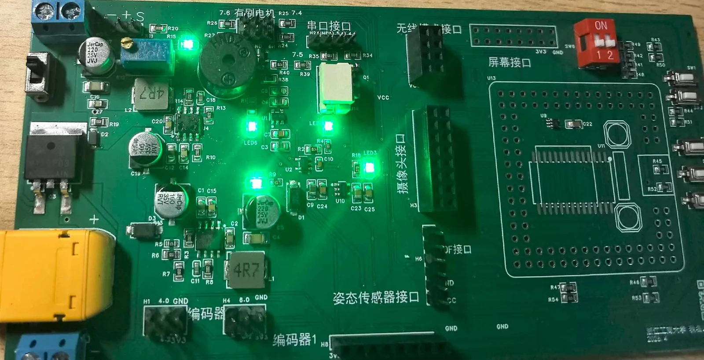
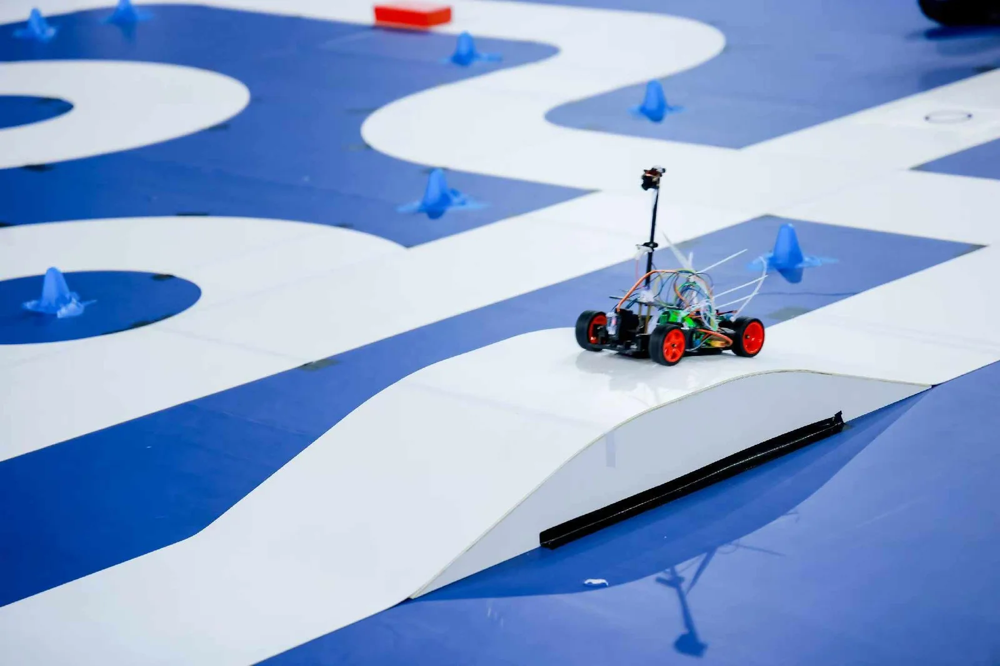

记得是大一上学期9月，班级群里发了智能车招新的通知，抱着试一试的心态，我填写了报名问卷。初试，考察c语言。好在我暑假里面自学了一些，顺利通过了测试，虽然说只做对了2道题目。国庆回来以后，复试开始了，一天的时间，让我们使用arduino实现循迹小车，当时的我何队友什么都不会，硬是通过ai和上网查询资料，12个小时，完成了前2道题目，顺利进入了车队。

每周天去参加智能车的培训，学习基本的算法以及硬件布局技巧。后面硬软分开培训了，刚刚被选中成为硬件组成员的时候，整个人是懵的。消息来得突然，像一记不轻不重的闷拳，砸在胸口上。我什么都不会——工具不会用，元器件不认识，连常见的电阻电容都分不清，色环电阻的读数还要偷偷用手机查。第一次走进实验室，学长递过来一块电路板，沉甸甸的，我接过来，正面反面看了半天，密密麻麻的焊盘、走线、丝印，像一座缩微的、陌生的城市，我不知道该先看什么。

他看出我的窘迫，说：“你先从电源开始调，把万用表拿过来。”我走到工作台前，拿起万用表，表笔攥在手里，却愣在那儿——我连红表笔插哪个孔都不知道。那种感觉像被剥光了扔在众人面前，脸烫得能煎蛋。

第一次焊板子，烙铁在手里抖。那根烙铁比想象中沉，握柄被无数人磨得发亮，可我握着它，笨拙得像握着一根烧火棍。烙铁头凑近焊盘，手却不受控制地微微发颤，锡丝熔化的一瞬，“嗤”的一声，焊盘被我活生生烫掉了，铜箔翘起来，像翻起的死皮。松香烧焦的味道直往鼻子里钻，刺鼻又心慌。学长从我手里抽走烙铁，把板子翻过来看了一眼，语气平静得没有一丝波澜：“还能救。”他拿起一根细如发丝的飞线，烙铁轻点，锡液流淌，眨眼间一个焊点圆润得像水滴，稳稳趴在那里，光亮，饱满。我呆住了，问他：“这怎么做到的？”他笑了一下，把那把烙铁递还给我：“多烫几次就知道了。”

上学期期末硬件考核，焊接完，检查了好几遍才敢上电。万用表读数稳稳跳出来，输出电压正常，我心里刚浮起一丝暗喜，还没来得及笑，“啪”一声脆响，一个直插式的滤波电容直接炸了。那股白烟冒出来，像一个小小的、愤怒的魂魄，带着焦糊的化学味，焊盘被炸得漆黑，铝壳裂开，残骸歪倒在板子上。我吓得往后一退，心脏狂跳。学长走过来看了看：“是不是耐压值选太小了？”我一怔，低头翻看电容上的标称，果然耐压不够。那一声炸响，像一记耳光，把我抽醒了一点。后来改了参数，重新换上电容，总算颤颤巍巍地通过了。

寒假，老师说要选省赛组别，我们掂量了许久，选了相对容易的雁过留痕。学长说，这辆车上的主板、驱动、负压电调，全部都要自己布局、自己焊接，这是一个不小的考验。我听着，握着鼠标的手不自觉地收紧，心里一半是跃跃欲试的兴奋，一半是深不见底的惶恐。

第一次布局PCB，打开EDA软件，面对空白的画布，元器件像散落一地的积木，我不知道该先摆哪一颗。连线更是简单的连连看，电源线跟信号线一样粗细，地线随手绕，自动布线一般横平竖直，从没想过信号干扰、回流路径、环路面积这些词真正的分量。第一版发出去，学长看了，叹了一口气。那声叹息很轻，却像秤砣一样砸在我心上。他耐心地指出一堆严重的错误，晶振离芯片太远，功率回路大得能跑马，去耦电容形同虚设。他说，重新画。

然后是第二版，第三版，第四版。每一版都被标满红色的批注，每一次修改都在碰壁中慢慢啃下一点小知识点：去耦电容要紧紧贴着引脚放，功率地要铺铜铺得坦坦荡荡，走线该粗的地方绝不能再细。终于打板了，心里竟生出一丝近乎神圣的期待，像等一封远方的信。

板子到手那天，我急不可耐地焊接。十二伏转五伏，五伏转三点三，原理图上画得清清楚楚，可焊出来就是不对。输出要么一片死寂，要么乱跳不止。示波器探针搭上去，波形跳得像心电图，毛刺和杂波在屏幕上疯狂舞蹈。我反复检查焊接、排查短路，急得满头是汗。

学长在旁边看了一会儿，伸手指着功率地那一块：“芯片的功率地没有和外面的地相连，输出电压反馈不到芯片，所以芯片在乱调。”我像被点中穴位，一下子全明白了。当时是七月十一日，距离省赛还有九天。心脏猛地一沉，九天，快递、焊接、调试，每一秒都珍贵得像金子。

我连夜修改布局，对着原理图一根一根重新走线，把功率地和模拟地分开，单点连接，重新铺铜。熬到凌晨三点，眼睛酸涩得睁不开，终于改完发出去，给立创下了加急SMT。本以为能提前到，结果交期一延再延，快递居然还遗失了。查物流看到“异常”两个字时，我差点崩溃。最后，二十号上午，快递才姗姗来迟，我抱着箱子冲进227实验室，手都在抖。拆包、焊接、检查，上电那一刻，所有的灯全部亮了，一排指示灯像夜里忽然炸开的星星。我屏住呼吸，用万用表一个模块一个模块地测量，电压纹丝不动，5.00伏，3.30伏，正常，全部正常。

紧绷了九天的弦，忽然松下来，鼻腔竟有点发酸。下午，我们赶去工大交车，明天，就是省赛.

七月二十一日，省赛。车在赛道上跑，我在旁边站着，手里攥着一把螺丝刀和抹布，手心全是汗，抹布是预备擦轮胎用的。

赛道上的光打下来，那辆自己亲手焊、亲手调的车，拐过一个弯，稳稳切入十字，绕出环岛，冲上斜坡，碾过路障，穿过斑马线——没有冲出去！每一个元素，都平安穿过。车停下来的那一刻，我才发现自己一直咬着嘴唇，松开时，唇上留下深深一道牙印，又疼，又甜。

完赛了。成绩并不是靠前，但看着赛道边那些疾驰而过的车，我心里没有失落，只有一种酸胀的、几乎要溢出来的充实。这毕竟是一次难得的记忆，像第一次把焊点焊得光亮，像那一根飞线救回的板子，像我鼻尖挥之不去的松香味。明年，继续加油。

最后，感谢老师的引领，学长的指导，同学的帮助，队友的配合。谢谢你们，让cmchen取得了现在的进步。

