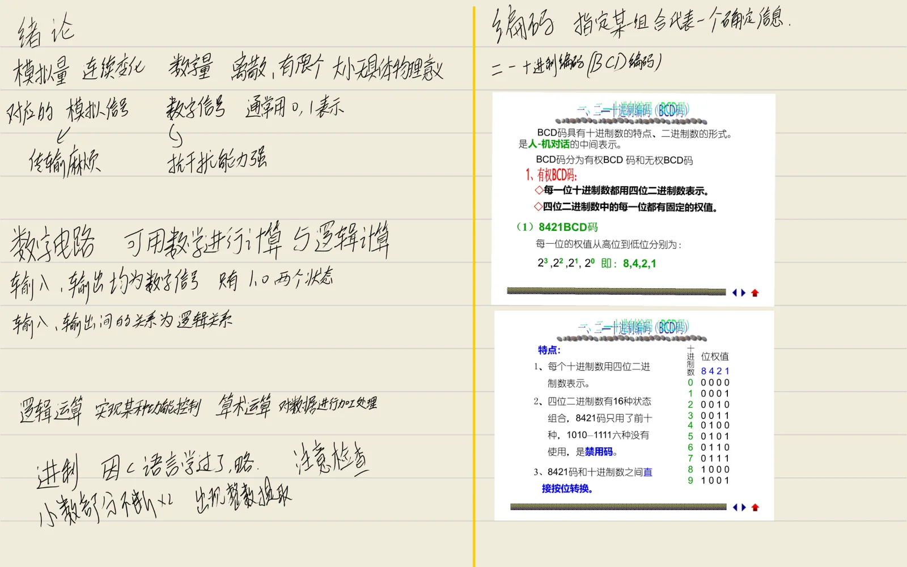
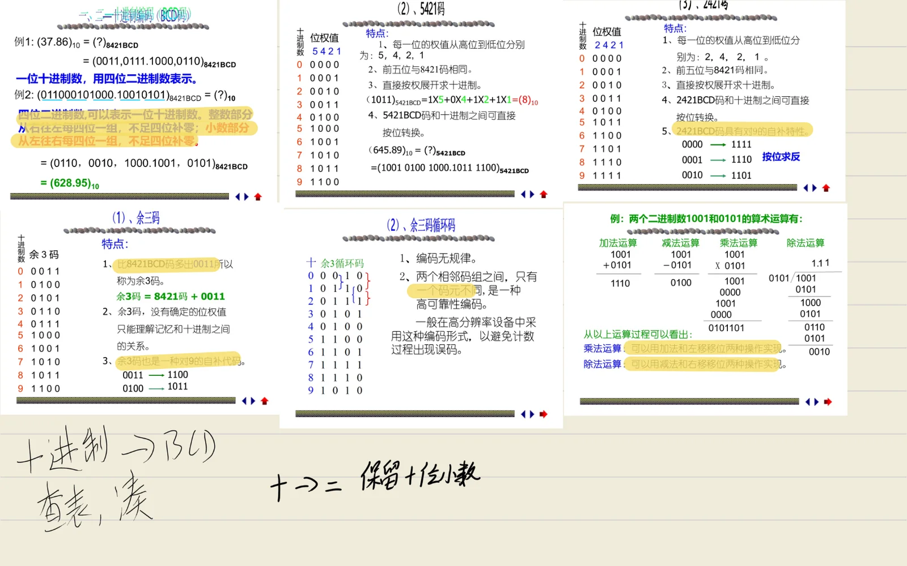

## 第一章 绪论

### 1. 数字量和模拟量

自然界存在两类物理量：

- **数字量**：变化在时间上和数量上都是离散的、不连续的。其值的大小和增减变化都是某一个最小数量单位的整数倍，且无任何物理意义。表示数字量的信号称为**数字信号**，工作在数字信号下的电子电路称为**数字电路**。
- **模拟量**：变化在时间上和数量上都是连续的，如时间、温度、压力、速度等。表示模拟量的信号称为**模拟信号**，工作在模拟信号下的电子电路称为**模拟电路**。

### 2. 数字信号和数字电路

**数字信号**是不连续的、离散的量，其值的大小无具体的物理意义。通常用 `0` 和 `1` 表示，如：
- 开关的通断
- 电位的高低
- 脉冲的有无

**数字电路的特点**：
1. 可对数字信号进行算术（+、-、×、÷）运算和逻辑运算。
2. 输入、输出都是数字信号，且只有 `0` 或 `1` 两种状态。
3. 输入、输出间的关系为逻辑关系。

### 3. 数字信号的特点

与模拟信号相比，数字信号具有以下优点：
- **通信系统**：抗干扰强、保密性好，便于信息处理和控制。
- **测量仪表**：测量精度高、功能强大、易实现自动化和智能化。
- **集成系统**：可靠性高、易集成化、微型化。

21世纪是信息数字化的时代，数字信号将广泛应用于通讯、计算机、自动控制和航空航天等领域。

---

## 第二章 数制与编码

在数字设备中，存在两种不同类型的运算：
- **逻辑运算**：实现某种功能控制。
- **算术运算**：对数据进行加工处理。

数字设备中采用二进制数，其中数、字母、符号都以特定二进制码表示。

### 2.1 进位计数制

进位计数制是指有序数字低位和相邻高位之间进位的关系。常用进制有十进制、二进制、八进制和十六进制等。

#### 一、十进制数
- 采用 0 ~ 9 十个有序数和一个小数点“.”表示。
- 低位和相邻高位之间的关系：**逢十进一、借一当十**。

任意十进制数 \(N\) 可表示为：

\[
N_{10} = (a_{n-1}a_{n-2}\ldots a_1a_0.a_{-1}a_{-2}\ldots a_{-m})_{10}
\]

按位权展开：

\[
N_{10} = \sum_{i=-m}^{n-1} a_i \times 10^i, \quad 0 \le a_i \le 9
\]

#### 二、二进制数
- 采用 0, 1 两个有序数和一个小数点“.”表示。
- 低位和相邻高位之间的关系：**逢二进一、借一当二**。

任意二进制数 \(N_2\) 表示为：

\[
N_2 = (b_{n-1}b_{n-2}\ldots b_1b_0.b_{-1}b_{-2}\ldots b_{-m})_2 = \sum_{i=-m}^{n-1} b_i \times 2^i
\]

#### 三、任意 R 进制数
- 采用 0, 1, 2, …, R-1 共 R 个有序数和一个小数点“.”表示。
- 低位和相邻高位之间的关系：**逢 R 进一、借一当 R**。

\[
N_R = (C_{n-1}C_{n-2}\ldots C_1C_0.C_{-1}C_{-2}\ldots C_{-m})_R = \sum_{i=-m}^{n-1} C_i \times R^i, \quad 0 \le C_i \le R-1
\]

**常用进制**：
- **八进制（R=8）**：逢八进一，数码 0~7。
- **十六进制（R=16）**：逢十六进一，数码 0~9, A(10), B(11), C(12), D(13), E(14), F(15)。

#### 几种进位计数制的对应关系

| 十进制 | 二进制 | 三进制 | 四进制 | 八进制 | 十六进制 |
|--------|--------|--------|--------|--------|----------|
| 0      | 0      | 0      | 0      | 0      | 0        |
| 1      | 1      | 1      | 1      | 1      | 1        |
| 2      | 10     | 2      | 2      | 2      | 2        |
| 3      | 11     | 10     | 3      | 3      | 3        |
| 4      | 100    | 11     | 10     | 4      | 4        |
| 5      | 101    | 12     | 11     | 5      | 5        |
| 6      | 110    | 20     | 12     | 6      | 6        |
| 7      | 111    | 21     | 13     | 7      | 7        |
| 8      | 1000   | 22     | 20     | 10     | 8        |
| 9      | 1001   | 100    | 21     | 11     | 9        |
| 10     | 1010   | 101    | 22     | 12     | A        |
| 11     | 1011   | 102    | 23     | 13     | B        |
| 12     | 1100   | 110    | 30     | 14     | C        |
| 13     | 1101   | 111    | 31     | 15     | D        |
| 14     | 1110   | 112    | 32     | 16     | E        |
| 15     | 1111   | 120    | 33     | 17     | F        |
| 16     | 10000  | 121    | 100    | 20     | 10       |

### 2.2 数制转换

#### 一、任意 R 进制数转换为十进制数
采用**多项式替代法**：按位权展开，按十进制运算规则求和。

**例1：二进制 → 十进制**
\[
(11010.11)_2 = 1\times2^4 + 1\times2^3 + 0\times2^2 + 1\times2^1 + 0\times2^0 + 1\times2^{-1} + 1\times2^{-2} = (26.75)_{10}
\]

**例2：八进制 → 十进制**
\[
(137.504)_8 = 1\times8^2 + 3\times8^1 + 7\times8^0 + 5\times8^{-1} + 0\times8^{-2} + 4\times8^{-3} = (95.6328125)_{10}
\]

**例3：十六进制 → 十进制**
\[
(12AF.B4)_{16} = 1\times16^3 + 2\times16^2 + 10\times16^1 + 15\times16^0 + 11\times16^{-1} + 4\times16^{-2} = (4783.703125)_{10}
\]

#### 二、十进制数转换为 R 进制数
整数部分和小数部分分别转换。

1. **整数部分**：采用**基数除法**（除R取余，逆序排列）。
2. **小数部分**：采用**基数乘法**（乘R取整，顺序排列）。

**例4：(73.475)₁₀ = (?)₂** （练习）
> 整数部分：73 ÷ 2 = 36 余 1，36 ÷ 2 = 18 余 0，18 ÷ 2 = 9 余 0，9 ÷ 2 = 4 余 1，4 ÷ 2 = 2 余 0，2 ÷ 2 = 1 余 0，1 ÷ 2 = 0 余 1 → (1001001)₂  
> 小数部分：0.475 × 2 = 0.95 → 0，0.95 × 2 = 1.9 → 1，0.9 × 2 = 1.8 → 1，0.8 × 2 = 1.6 → 1，0.6 × 2 = 1.2 → 1，… 可近似为 (0.01111)₂  
> 结果约 (1001001.01111)₂

#### 三、任意两种进位制之间的转换
利用十进制作为桥梁：\( (N)_{\alpha} \to (N)_{10} \to (N)_{\beta} \)

结果：(1023.231)₄ = (75.703125)₁₀ = (300.32)₅

#### 四、基数为 \(2^k\) 进位制之间的转换
- 一位八进制数可用三位二进制数表示（\(2^3=8\)）。
- 一位十六进制数可用四位二进制数表示（\(2^4=16\)）。

**例1：(65.307)₈ = (?)₂**
\[
(65.307)_8 = (110\,101\,.\;011\,000\,111)_2
\]

**例2：(A2D.E)₁₆ = (?)₂**
\[
(A2D.E)_{16} = (1010\,0010\,1101\,.\;1110)_2
\]

**例3：(BF.28A)₁₆ = (?)₈**
先转二进制，再转八进制：
\[
(BF.28A)_{16} = (1011\,1111\,.\;0010\,1000\,1010)_2 = (010\,111\,111\,.\;001\,010\,001\,010)_2 = (277.1212)_8
\]

---

### 2.3 编码

**编码**：指定二进制组合代表一个确定的信息。  
**代码**：具有确定信息的符号。

#### 二-十进制编码（BCD码）
BCD码具有十进制数的特点、二进制数的形式，是“人-机对话”的中间表示。

##### 1. 有权BCD码
每位十进制数用4位二进制数表示，且每一位有固定权值。

**（1）8421BCD码**
- 权值：8, 4, 2, 1
- 使用0000~1001表示0~9，1010~1111为禁用码。

| 十进制 | 8421BCD |
|--------|---------|
| 0      | 0000    |
| 1      | 0001    |
| 2      | 0010    |
| 3      | 0011    |
| 4      | 0100    |
| 5      | 0101    |
| 6      | 0110    |
| 7      | 0111    |
| 8      | 1000    |
| 9      | 1001    |

**例：(37.86)₁₀ = (0011 0111.1000 0110)₈₄₂₁BCD**  
**例：(0110 0010 1000.1001 0101)₈₄₂₁BCD = (628.95)₁₀**

**（2）5421BCD码**
- 权值：5, 4, 2, 1
- 前五位与8421码相同。

| 十进制 | 5421BCD |
|--------|---------|
| 0      | 0000    |
| 1      | 0001    |
| 2      | 0010    |
| 3      | 0011    |
| 4      | 0100    |
| 5      | 1000    |
| 6      | 1001    |
| 7      | 1010    |
| 8      | 1011    |
| 9      | 1100    |

**例：(645.89)₁₀ = (1001 0100 1000.1011 1100)₅₄₂₁BCD**

**（3）2421BCD码**
- 权值：2, 4, 2, 1
- 具有对9的自补特性（按位取反即得9的补码）。

| 十进制 | 2421BCD |
|--------|---------|
| 0      | 0000    |
| 1      | 0001    |
| 2      | 0010    |
| 3      | 0011    |
| 4      | 0100    |
| 5      | 1011    |
| 6      | 1100    |
| 7      | 1101    |
| 8      | 1110    |
| 9      | 1111    |

##### 2. 无权BCD码
没有确定的位权值，不能按位权展开。

**（1）余3码**
- 等于8421码加0011。
- 也具有对9的自补特性。

| 十进制 | 余3码 |
|--------|-------|
| 0      | 0011  |
| 1      | 0100  |
| 2      | 0101  |
| 3      | 0110  |
| 4      | 0111  |
| 5      | 1000  |
| 6      | 1001  |
| 7      | 1010  |
| 8      | 1011  |
| 9      | 1100  |

**（2）余3循环码**
- 相邻两个码组之间只有一个码元不同，属于高可靠性编码，常用于高分辨率设备以避免计数误码。

| 十进制 | 余3循环码 |
|--------|-----------|
| 0      | 0010      |
| 1      | 0110      |
| 2      | 0111      |
| 3      | 0101      |
| 4      | 0100      |
| 5      | 1100      |
| 6      | 1101      |
| 7      | 1111      |
| 8      | 1110      |
| 9      | 1010      |

---

### 2.4 算术运算和逻辑运算

在数字电路中，1位二进制数码可以用0和1表示两种对立逻辑状态，称为**二值逻辑**。

- **算术运算**：二进制算术运算规则与十进制基本相同，区别在于“逢二进一”。

**例**：1001 + 0101 = 1110；1001 - 0101 = 0100（采用补码运算）。

- **补码表示**：
- 最高位为符号位：0表示正数，1表示负数。
- 正数的补码与原码相同。
- 负数的补码：原码求反（符号位不变）再加1。

**例：计算 (1001)₂ - (0101)₂**
\[
(+1001)_{\text{补}} = 01001, \quad (-0101)_{\text{补}} = 11011
\]
相加：
\[
01001 + 11011 = 100100 \quad \text{舍去进位，得 } 00100 = (0100)_2
\]
结果为 (0100)₂，即 (4)₁₀。减法运算变为加法，简化了电路结构。

- **逻辑运算**：按指定的因果关系进行运算，将在后续章节详细介绍。

---

